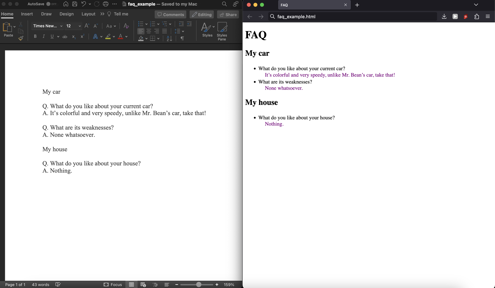

# faq2html
Convert a structured docx file with FAQs to html.

### why?
- i want an easy way to convert a docx file with FAQs to html.
- .docx files are easy to create using word processor apps that support spell check.
- want something portable (for other use cases), so not relying on templating.

### but `X` exists
- lazy Sunday afternoon, just build it.
- gives me a chance to procrastinate on work i should be doing instead.

### usage

command: `python main.py <input_file> <output_file>`

example: 
```bash
python main.py "/Users/abasu/Desktop/faq_maker/faq_example.docx" "/Users/abasu/Desktop/faq_maker/faq_example.html"
```


